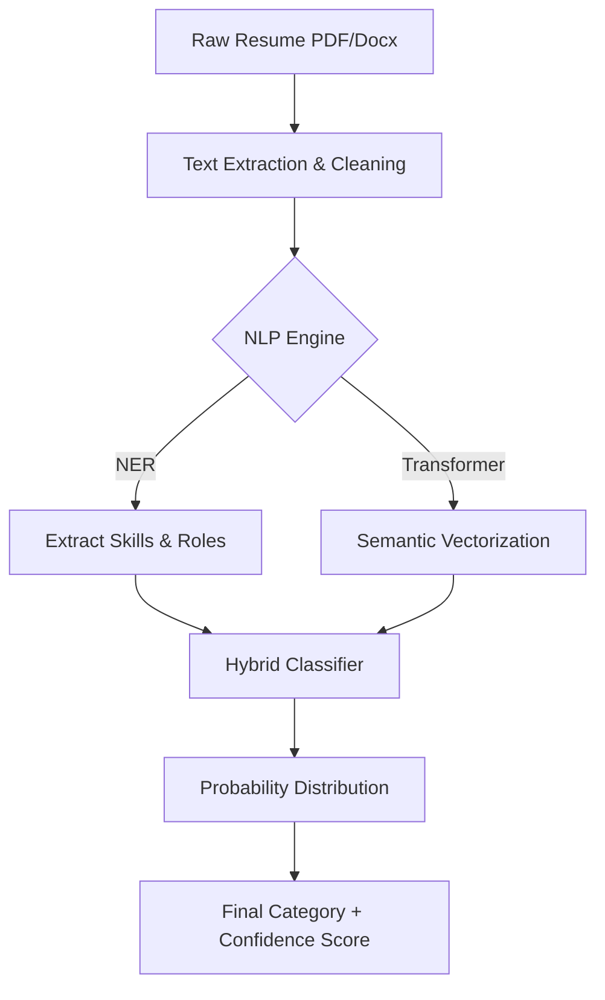

Viewed ModelSelector.jsx:1-37

To evolve **ResumeModel_v2** from a baseline experiment into a robust, high-accuracy production system, a multi-faceted approach is required. The current 57% accuracy is a result of using traditional statistical methods (TF-IDF/KNN) on a noisy, merged dataset.

I have created a strategic roadmap for **ResumeModel_v3** and beyond, focusing on state-of-the-art AI techniques used in industry-leading recruitment platforms.

### Model Improvement Strategy (Roadmap to Production)

#### 1. Transition to Semantic Embeddings (Beyond TF-IDF)

* **The Problem:** TF-IDF only looks for exact word matches. If a resume says "Full Stack Developer" and the job needs a "Software Engineer," TF-IDF may not see the connection.
* **The Solution:** Use **Transformers (BERT, RoBERTa, or DeBERTa)**. These models use "Contextual Word Embeddings." They understand that "Python" in a resume is a skill, not a snake, and that "Lead" and "Manager" carry similar professional weight.
* **Action:** Replace `TfidfVectorizer` with a pre-trained model like `all-MiniLM-L6-v2` from HuggingFace to convert resumes into high-dimensional semantic vectors.

#### 2. Advanced Section-Aware Parsing

* **The Problem:** The current model treats the entire resume as a single "bag of words." It gives the same importance to a hobby (e.g., "Fishing") as it does to a core skill (e.g., "Java").
* **The Solution:** Implement **Named Entity Recognition (NER)** to extract specific sections: *Skills*, *Experience*, *Education*, and *Certifications*.
* **Action:** Train a SpaCy NER model to identify entities. Weight the "Skills" and "Experience" sections more heavily in the final classification logic.

#### 3. Handling Class Imbalance (SMOTE & Data Augmentation)

* **The Problem:** As noted in the report, some categories like "BPO" or "Automobile" have very few samples, leading to 0% accuracy.
* **The Solution:** Use **SMOTE (Synthetic Minority Over-sampling Technique)** to create "synthetic" resumes for underrepresented categories. Alternatively, use LLMs (like GPT-4) to generate 50-100 high-quality synthetic resumes for each small category.

#### 4. Ensemble Learning Architecture

* **The Problem:** A single KNN model is sensitive to outliers and doesn't handle high-dimensional text data as well as modern classifiers.
* **The Solution:** Use a **Voting or Stacking Classifier**. Combine the strengths of:
    1. **XGBoost/LightGBM:** Excellent for structured features (years of experience, degree level).
    2. **Logistic Regression:** Surprisingly strong for high-dimensional text.
    3. **Neural Networks:** For capturing complex patterns in project descriptions.

#### 5. MLOps: Continuous Learning & Feedback

* **The Problem:** Professional titles evolve (e.g., "Prompt Engineer" didn't exist 3 years ago). Models become "stale."
* **The Solution:** Implement a **Human-in-the-loop (HITL)** system. When the scanner predicts a category, allow the user to correct it. Save these corrections to a "Gold Dataset" and re-train the model monthly.

### Proposed Architecture for v3

> [!TIP]
> **Production Recommendation:**
> For a "Real World" model, accuracy isn't the only metric. You should also track **Inference Latency** (how fast the scan takes) and **Model Drift** (how accuracy changes over time as new types of resumes appear).
